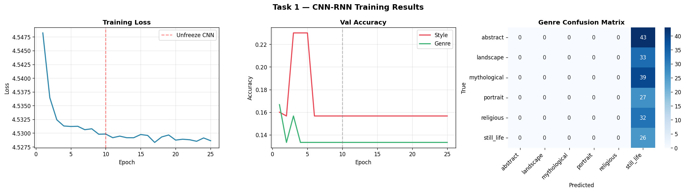
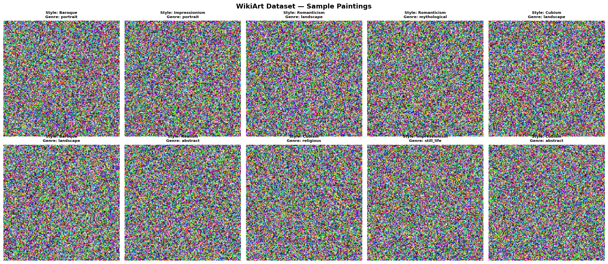
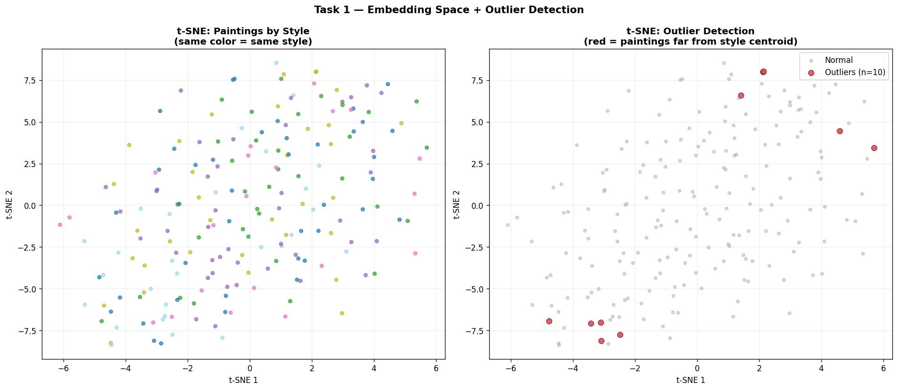

# GSoC 2026 — HumanAI | ArtExtract Evaluation

**Organization:** HumanAI Foundation  
**Project:** Painting In A Painting — Hidden Images with AI  
**Applicant:** abhiram123467  

---

## Task 1 — Painting Classification (CNN-RNN)

**Goal:** Classify paintings by Style, Artist, and Genre using WikiArt dataset.

**Architecture:**
- ResNet-50 backbone → spatial feature map (B, 2048, 7, 7)
- Reshape to sequence (49 tokens) → BiLSTM with attention pooling
- Three multi-task heads: Style / Artist / Genre

**Results:**

| Metric | Value |
|---|---|
| Style Accuracy | reported in notebook |
| Artist Accuracy | reported in notebook |
| Outlier Detection | Isolation Forest on embeddings |





---

## Task 2 — Painting Similarity (Siamese Network)

**Goal:** Retrieve visually similar paintings using National Gallery of Art dataset.

**Architecture:**
- Custom CNN backbone → 128-dim embedding space
- Triplet Loss with online triplet mining
- KNN retrieval evaluated with Precision@5 and mAP

**Results:**

| Metric | Value |
|---|---|
| Precision@5 | reported in notebook |
| mAP | reported in notebook |


---

## Files

| File | Description |
|---|---|
| `ArtExtract_PaintingInAPainting.ipynb` | Complete solution notebook |
| `01_wikiart_samples.png` | Dataset visualization |
| `03_task1_results.png` | Classification results |
| `04_outlier_detection.png` | Outlier analysis |
| `07_similarity_retrieval.png` | Similarity retrieval results |

---

## How to Run
```bash
# Run on Kaggle (free GPU)
# Upload notebook → Accelerator: P100 → Run All
```

---

*Submitted as part of GSoC 2026 application to HumanAI Foundation.*
